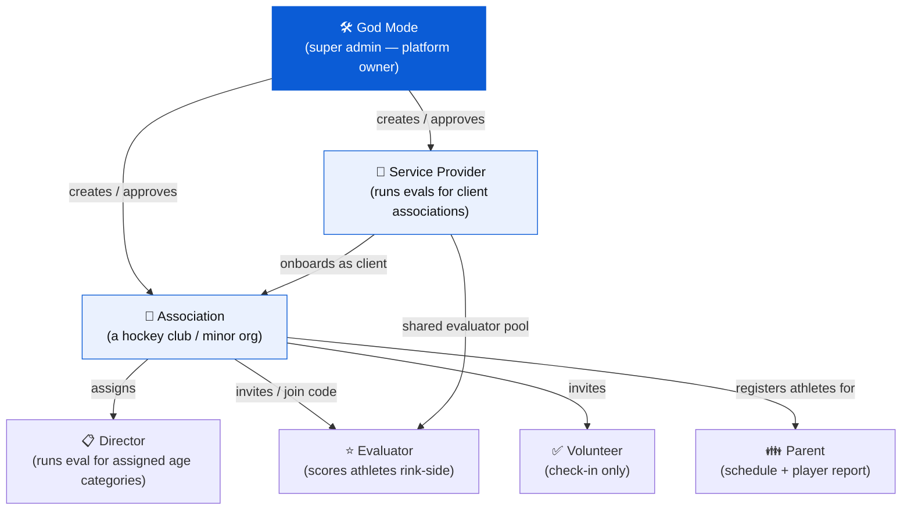
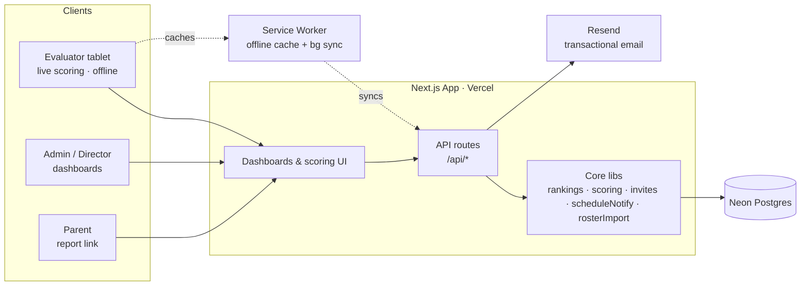
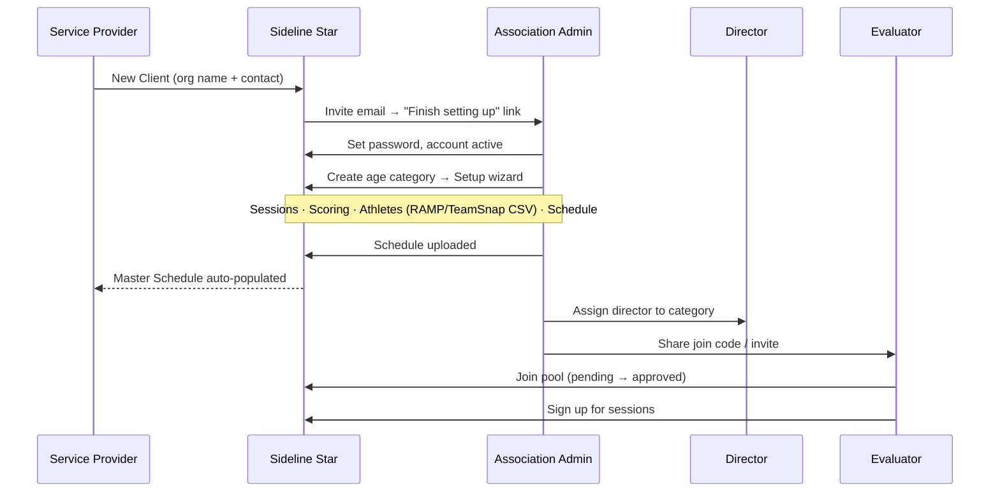
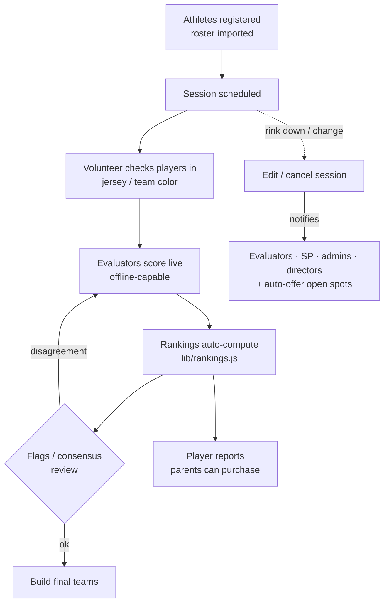
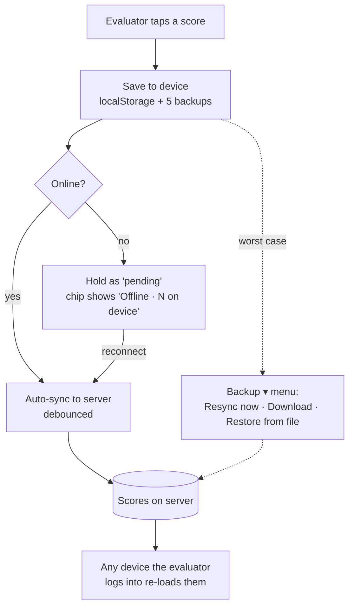
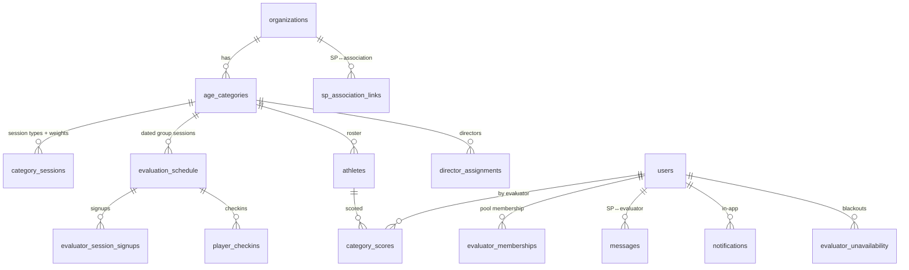

# Sideline Star — Architecture & User Flows

Visual reference for how the platform is structured and how each role moves through it.
Diagrams use [Mermaid](https://mermaid.js.org) and render automatically on GitHub.

---

## 1. Roles & who reports to whom

**Two onboarding paths for an association**
- **SP-managed:** a Service Provider creates the association as a client (SP approves).
- **Independent:** an association signs itself up and **God Mode** approves it.

---

## 2. System map (where things live)

**Single source of truth:** the `evaluation_schedule` table is shared — when an association/director edits it, the Service Provider's Master Schedule sees the same rows instantly (no copy/sync).

---

## 3. Onboarding flow (SP → association → director → evaluators)

---

## 4. Evaluation lifecycle (game day → teams)

---

## 5. Live scoring + offline safety

---

## 6. Key data model (simplified)

> Rankings are **computed**, not stored: `lib/rankings.js` derives them from
> `category_scores` + `category_sessions` weights on demand.
